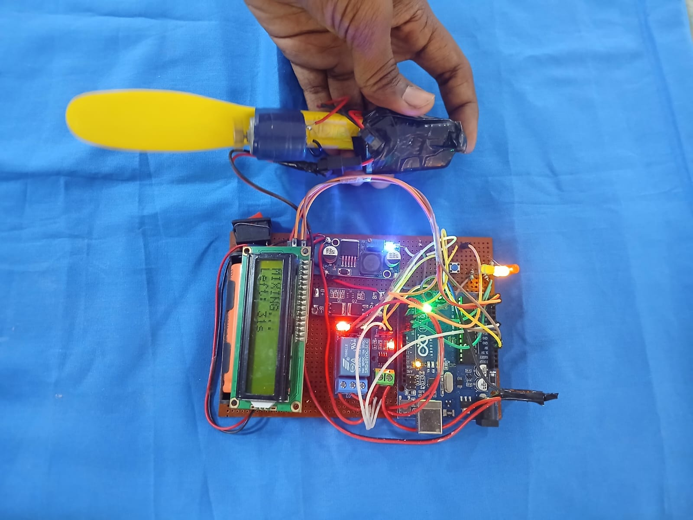
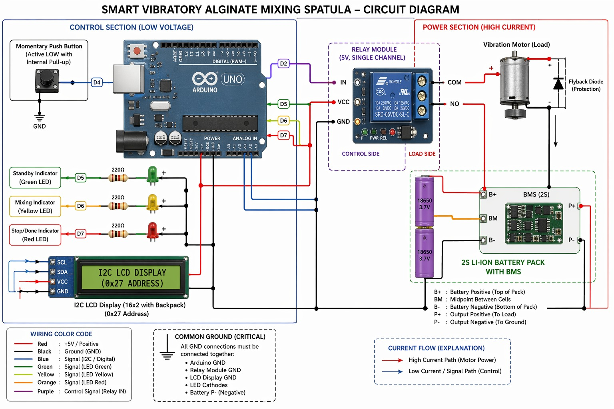
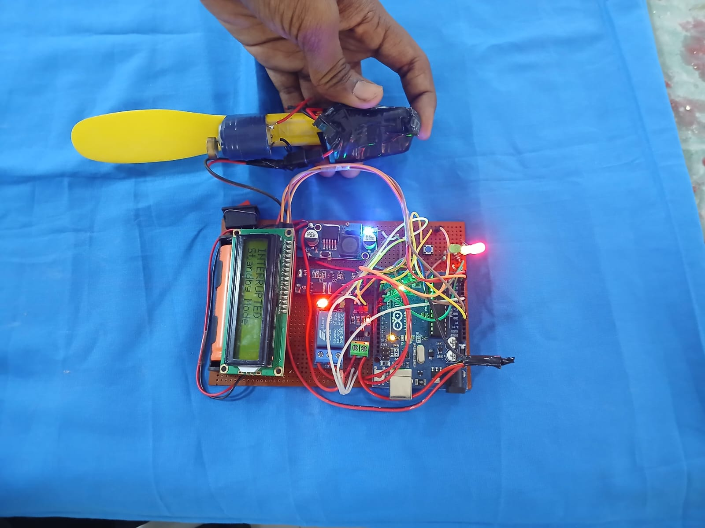

# Smart Vibratory Alginate Mixing Spatula

## Overview

The Smart Vibratory Alginate Mixing Spatula is an Arduino-based prototype designed to improve the alginate mixing process by combining traditional manual spatulation with controlled vibration assistance and an interactive user interface.

The system uses a vibration motor to aid the mixing process while providing real-time feedback using LEDs and an LCD display. The objective is to improve consistency, reduce operator dependency, and create a guided mixing process.

---

## Problem Statement

Traditional alginate mixing is generally performed manually, which can lead to:

- Inconsistent mixing quality
- Air bubble formation
- Uneven powder wetting
- Dependence on operator skill
- Variations in final material consistency

This project aims to reduce these limitations through a simple embedded system solution.

---

## Objectives

- Improve mixing efficiency using vibration assistance
- Reduce inconsistencies during manual mixing
- Provide user-friendly visual feedback
- Automate the mixing duration
- Create a low-cost and scalable prototype

---

## Features

- Vibration-assisted mixing
- One-button operation
- Automatic motor shutdown after predefined duration
- Manual interruption capability
- LCD-based user interface
- LED status indicators
- Rechargeable battery operation
- Startup animation and status display

---

## System Workflow

### Step 1: Power ON

- System initializes
- LCD displays startup animation

### Step 2: Standby Mode

- Green LED turns ON

LCD displays:

    READY
    Press Button

### Step 3: Mixing Process

When the user presses the button:

- Relay activates the vibration motor
- Yellow LED turns ON
- LCD displays mixing status and remaining time

Example:

    MIXING...
    Left: 45s

### Step 4: Completion

After the predefined mixing duration:

- Motor stops automatically
- Red LED turns ON

LCD displays:

    DONE
    Remove Material

### Step 5: Manual Interruption

If the user manually interrupts the process:

    INTERRUPTED
    Standby Mode

The system then returns to standby mode.

---

## Hardware Components

- Arduino UNO
- DC vibration motor
- Single-channel relay module
- Push button switch
- 16x2 LCD with I2C interface
- Green LED
- Yellow LED
- Red LED
- 220Ω resistors
- 2S Li-ion battery pack
- Battery Management System (BMS)
- Connecting wires
- Breadboard / prototype board

---

## Pin Connections

| Component | Arduino Pin |
|------------|-------------|
| Relay Module | D2 |
| Push Button | D4 |
| Green LED | D5 |
| Yellow LED | D6 |
| Red LED | D7 |
| LCD SDA | A4 |
| LCD SCL | A5 |

---

## Circuit Connections

### Push Button

- One terminal → D4
- Other terminal → GND

### Relay Module

Control side:

- IN → D2
- VCC → 5V
- GND → GND

Load side:

- COM → Battery Positive
- NO → Motor Positive
- Motor Negative → Battery Negative

### LEDs

Green LED:

- D5 → 220Ω resistor → LED anode
- LED cathode → GND

Yellow LED:

- D6 → 220Ω resistor → LED anode
- LED cathode → GND

Red LED:

- D7 → 220Ω resistor → LED anode
- LED cathode → GND

### LCD (I2C)

- VCC → 5V
- GND → GND
- SDA → A4
- SCL → A5

---

## Software Used

- Arduino IDE
- Embedded C/C++
- LiquidCrystal_I2C Library

---

## Libraries Required

Install the following Arduino library before uploading code:

LiquidCrystal_I2C

---

## Folder Structure

Smart-Vibratory-Alginate-Mixing-Spatula/

├── README.md  
├── Arduino_Code/  
├── Circuit_Diagram/  
├── Images/  
├── Documentation/  
└── Components_List/  

---

## Project Images

Add project images inside the Images folder:

## Prototype

## Circuit Diagram

## Working Setup

---

## Future Improvements

- Real-time viscosity detection
- Current-based consistency estimation
- Battery percentage monitoring
- Compact PCB implementation
- Mobile application connectivity
- AI-assisted consistency prediction

---

## Applications

- Dental clinics
- Dental laboratories
- Medical device research
- Educational demonstrations
- Smart healthcare systems

---

## Conclusion

The Smart Vibratory Alginate Mixing Spatula combines vibration-assisted mixing with embedded control and user feedback mechanisms to create a more guided and efficient alginate mixing process. This project demonstrates how simple electronics and automation can improve usability and reduce process variability.

---

## Author

Madhavkrishnan K S                                                                          
Dept of Electronics and Communication Engineering                        
SRM Institute of Science and Technology, Ramapuram

Nishanthan R
Dept of Electrical and Electronics Engineering 
Easwari Engineering College, Ramapuram

